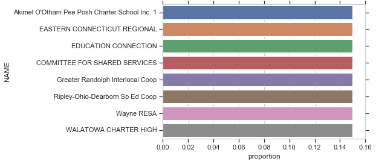
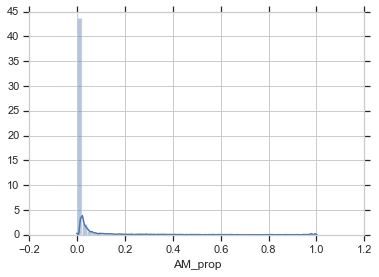
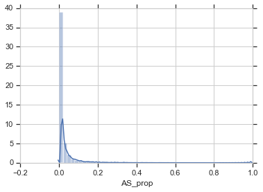
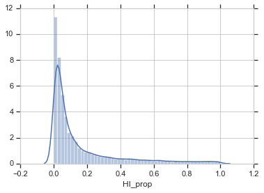
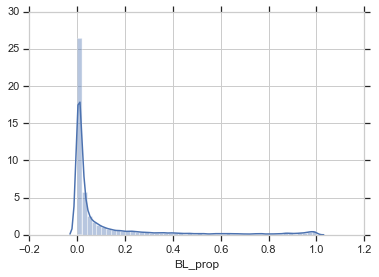
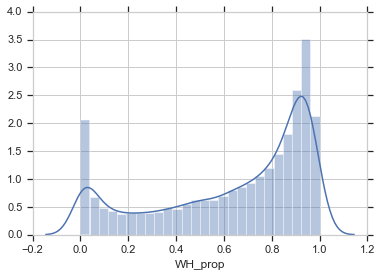
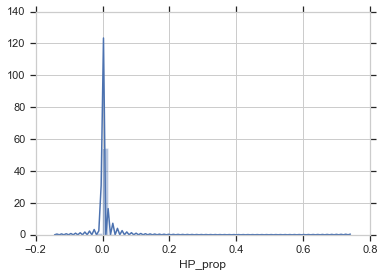
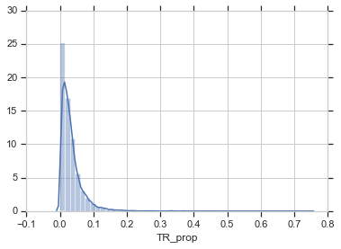
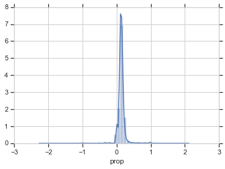

## Problem1


```python
import pandas as pd
import numpy as np
import matplotlib.pyplot as plt
import seaborn as sns
%matplotlib inline

fiscal_data = pd.read_csv("Sdf16_1a.txt", sep='\t')
fiscal_data = fiscal_data[fiscal_data.TFEDREV > 0]
fiscal_data_grouped = fiscal_data.groupby("STNAME").sum()
fiscal_data_sorted = fiscal_data_grouped.sort_values(by='TFEDREV', ascending=False)

#we suggest we evenly cut revenue for all schools so all cutting proportions would be same 15%
```

    C:\Users\hudie\Anaconda3\lib\site-packages\IPython\core\interactiveshell.py:2723: DtypeWarning: Columns (0,3) have mixed types. Specify dtype option on import or set low_memory=False.
      interactivity=interactivity, compiler=compiler, result=result)
    


```python

cut_district['prop'] = 0.15
sns.barplot(x="prop", y="NAME", data=cut_district.head(8))
```


    <matplotlib.axes._subplots.AxesSubplot at 0x16f945ea390>





## Problem 2
#### As we are cutting all schools evenly, so there won't be any bias in the distribution


```python
data = pd.read_csv("ccd_lea_052_1516_w_1a_011717.csv")
races_cols = ['LEAID', 'TOTAL', 'AM', 'AS', 
           'HI', 'BL', 'WH', 'HP', 'TR']
df_race = data[races_cols]
df_race = df_race[df_race['TOTAL'] > 0]
df_race['AM_prop'] = df_race['AM'] / df_race['TOTAL']
df_race['AS_prop'] = df_race['AS'] / df_race['TOTAL']
df_race['HI_prop'] = df_race['HI'] / df_race['TOTAL']
df_race['BL_prop'] = df_race['BL'] / df_race['TOTAL']
df_race['WH_prop'] = df_race['WH'] / df_race['TOTAL']
df_race['HP_prop'] = df_race['HP'] / df_race['TOTAL']
df_race['TR_prop'] = df_race['TR'] / df_race['TOTAL']
```

    C:\Users\hudie\Anaconda3\lib\site-packages\IPython\core\interactiveshell.py:2723: DtypeWarning: Columns (6) have mixed types. Specify dtype option on import or set low_memory=False.
      interactivity=interactivity, compiler=compiler, result=result)
    


```python
sns.distplot(df_race['AM_prop'],kde=True, rug=False)
```

    C:\Users\hudie\Anaconda3\lib\site-packages\scipy\stats\stats.py:1713: FutureWarning: Using a non-tuple sequence for multidimensional indexing is deprecated; use `arr[tuple(seq)]` instead of `arr[seq]`. In the future this will be interpreted as an array index, `arr[np.array(seq)]`, which will result either in an error or a different result.
      return np.add.reduce(sorted[indexer] * weights, axis=axis) / sumval
    


    <matplotlib.axes._subplots.AxesSubplot at 0x16f9ad1e080>





```python
sns.distplot(df_race['AS_prop'],kde=True, rug=False)
```

    C:\Users\hudie\Anaconda3\lib\site-packages\scipy\stats\stats.py:1713: FutureWarning: Using a non-tuple sequence for multidimensional indexing is deprecated; use `arr[tuple(seq)]` instead of `arr[seq]`. In the future this will be interpreted as an array index, `arr[np.array(seq)]`, which will result either in an error or a different result.
      return np.add.reduce(sorted[indexer] * weights, axis=axis) / sumval
    


    <matplotlib.axes._subplots.AxesSubplot at 0x16f947cb5f8>





```python
sns.distplot(df_race['HI_prop'],kde=True, rug=False)
```

    C:\Users\hudie\Anaconda3\lib\site-packages\scipy\stats\stats.py:1713: FutureWarning: Using a non-tuple sequence for multidimensional indexing is deprecated; use `arr[tuple(seq)]` instead of `arr[seq]`. In the future this will be interpreted as an array index, `arr[np.array(seq)]`, which will result either in an error or a different result.
      return np.add.reduce(sorted[indexer] * weights, axis=axis) / sumval
    


    <matplotlib.axes._subplots.AxesSubplot at 0x16f9d27c860>





```python
sns.distplot(df_race['BL_prop'],kde=True, rug=False)
```

    C:\Users\hudie\Anaconda3\lib\site-packages\scipy\stats\stats.py:1713: FutureWarning: Using a non-tuple sequence for multidimensional indexing is deprecated; use `arr[tuple(seq)]` instead of `arr[seq]`. In the future this will be interpreted as an array index, `arr[np.array(seq)]`, which will result either in an error or a different result.
      return np.add.reduce(sorted[indexer] * weights, axis=axis) / sumval
    


    <matplotlib.axes._subplots.AxesSubplot at 0x16f9d351da0>





```python
sns.distplot(df_race['WH_prop'],kde=True, rug=False)
```

    C:\Users\hudie\Anaconda3\lib\site-packages\scipy\stats\stats.py:1713: FutureWarning: Using a non-tuple sequence for multidimensional indexing is deprecated; use `arr[tuple(seq)]` instead of `arr[seq]`. In the future this will be interpreted as an array index, `arr[np.array(seq)]`, which will result either in an error or a different result.
      return np.add.reduce(sorted[indexer] * weights, axis=axis) / sumval
    


    <matplotlib.axes._subplots.AxesSubplot at 0x16f9d2778d0>





```python
sns.distplot(df_race['HP_prop'],kde=True, rug=False)
```

    C:\Users\hudie\Anaconda3\lib\site-packages\scipy\stats\stats.py:1713: FutureWarning: Using a non-tuple sequence for multidimensional indexing is deprecated; use `arr[tuple(seq)]` instead of `arr[seq]`. In the future this will be interpreted as an array index, `arr[np.array(seq)]`, which will result either in an error or a different result.
      return np.add.reduce(sorted[indexer] * weights, axis=axis) / sumval
    


    <matplotlib.axes._subplots.AxesSubplot at 0x16f9d519128>





```python
sns.distplot(df_race['TR_prop'],kde=True, rug=False)
```

    C:\Users\hudie\Anaconda3\lib\site-packages\scipy\stats\stats.py:1713: FutureWarning: Using a non-tuple sequence for multidimensional indexing is deprecated; use `arr[tuple(seq)]` instead of `arr[seq]`. In the future this will be interpreted as an array index, `arr[np.array(seq)]`, which will result either in an error or a different result.
      return np.add.reduce(sorted[indexer] * weights, axis=axis) / sumval
    


    <matplotlib.axes._subplots.AxesSubplot at 0x16f9d5e3320>





## Problem 3
#### as we are cutting expenditure for all schools, here we visualize all districts


```python

dist_data = pd.read_csv("ccd_lea_002089_1516_w_1a_011717.csv")
dist_data = dist_data[['LEAID', 'SPECED']]
dist_data = dist_data.merge(race_data)
dist_data['prop'] = dist_data['SPECED'] / dist_data['TOTAL']
sns.distplot(dist_data['prop'],kde=True, rug=False)
```

    C:\Users\hudie\Anaconda3\lib\site-packages\scipy\stats\stats.py:1713: FutureWarning: Using a non-tuple sequence for multidimensional indexing is deprecated; use `arr[tuple(seq)]` instead of `arr[seq]`. In the future this will be interpreted as an array index, `arr[np.array(seq)]`, which will result either in an error or a different result.
      return np.add.reduce(sorted[indexer] * weights, axis=axis) / sumval
    


    <matplotlib.axes._subplots.AxesSubplot at 0x16fa0eaf240>





# Problem 4
For Surui Yang's solution https://github.com/ethanyangxlg/DS5500-HW3/blob/master/ds5500%20HW3.ipynb. 

His solution suggests a two rounds cutting off. The first round will be a national wide one, which cut off 10% of federal budget evenly for every school districts. This will make sure cutting is not highly biased by districts.Then for second round of cutting. He will focus on school districts that have undesirable performance, using ALL_MTH00PCTPROF_1516 as metric and cut off the founds for those whose performance is below the 75 percentage.

The advantage of his solution is that it is fair and also flexible and good for districts with better performing schools, so that he is aiming to boost school performance nation wide.

However by doing this that means he will cut budget for districts with schools that performs not so well, these districts could be less developed strict and thus cutting funds for these schools could be bias. Some less districts could be the ones that really need outside help and funding; cutting funds for these schools could further harm their performance.

# Problem 4
For Surui Yang's solution https://github.com/ethanyangxlg/DS5500-HW3/blob/master/ds5500%20HW3.ipynb. 

His solution suggests a two rounds cutting off. The first round will be a national wide one, which cut off 10% of federal budget evenly for every school districts. This will make sure cutting is not highly biased by districts.Then for second round of cutting. He will focus on school districts that have undesirable performance, using ALL_MTH00PCTPROF_1516 as metric and cut off the founds for those whose performance is below the 75 percentage.

The advantage of his solution is that it is fair and also flexible and good for districts with better performing schools, so that he is aiming to boost school performance nation wide.

However by doing this that means he will cut budget for districts with schools that performs not so well, these districts could be less developed strict and thus cutting funds for these schools could be bias. Some less districts could be the ones that really need outside help and funding; cutting funds for these schools could further harm their performance.

# Problem 5

I will comment on my takeaways from the industry panel. 

The speakers for the industry panel, although all titied as data scientist, have very differnt job functioning and backgrounds.
I felt like the definition for data science is very broad in industry. There isn't a single or a set of skills/tools could define data scientist; in industry people are applying skills like machine learning, statistics or visualizations; and tools like python, R, excel. The key point is that data scientist are trying to solve real business problems in a data driven perspective, rather than purely model or engineer in a specific skill set. 

Also, from the guest speakers i have learned that domain knowledge and the ability to commnicate to non-tech people are very important.At the end of day we want our data-driven solution to be able to solve business problems, which require us cooperate with all people from all different backgrounds.


```python

```
